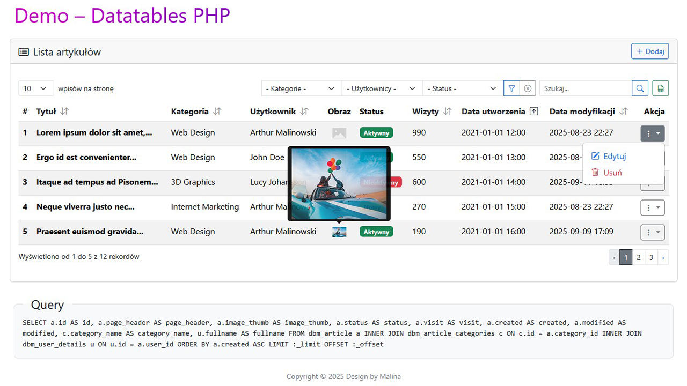

# DbM DataTables PHP

Wszystkie prawa autorskie zastrzeżone przez **Design by Malina (DbM)**

## Wprowadzenie
Ta biblioteka rozszerza możliwości generowania tabel z paginacją i AJAX w aplikacjach PHP. Obsługuje dwa tryby:
- **PHP mode** – cała tabela renderowana jest na serwerze i zwracana jako HTML.
- **AJAX mode** – dane i widoki (thead, tbody, paginacja) są zwracane jako JSON, a następnie renderowane przez JS.

Pozwala to na elastyczne i wydajne zarządzanie dużymi zestawami danych.

---

## Instrukcja uruchomienia - demo

### Import bazy demo  
W katalogu `_Documents/Database` znajduje się gotowy plik SQL.  
Zaimportuj go do swojej instancji MySQL/MariaDB:  

```bash
mysql -u root -p dbm_datatables < _Documents/Database/dbm_datatables.sql
```

### Konfiguracja adaptera  
W katalogu `src/Datatable` znajduje się plik `DatabaseAdapter.php`.  
Adapter mapuje `App\Core\Interfaces\DatabaseInterface` na interfejs biblioteki DataTables.  

W katalogu `src/Core/Classes` znajduje się klasa `Database`, która implementuje interfejs `DatabaseInterface` i odpowiada za konfigurację bazy (DSN, użytkownik, hasło).  

Upewnij się, że Twoja klasa AppDb jest poprawnie skonfigurowana (połączenie z bazą).  

```php
$appDb = new Database(/* host, user, pass, db */);
$dbAdapter = new DatabaseAdapter($appDb);
```

### Konfiguracja DataTable  
W katalogu `src/Datatable` znajduje się plik BlogConfigDataTable.php.  
To on definiuje źródło danych (tabela dbm_article) oraz mapowania kolumn.  

```php
$config = new BlogConfigDataTable($dbAdapter);
```

Wszystkie ustawienia potrzebne do działania DataTables PHP znajdują się w pliku `ConfigDataTable`.

### Uruchomienie w aplikacji (przykład z kontrolerem)  
W przykładowej aplikacji DataTables można osadzić w kontrolerze.  
W katalogu `src/Controller` znajduje się `DemoController`, którego metoda `run()` przygotowuje dane dla widoku.  

**index.php**:  
```php
use App\Controller\DemoController;
use Dbm\DataTables\Src\Renderers\DataTableRenderer;

// === Run ===
$demo = new DemoController();
extract($demo->run());

// === Render ===
$datatableRenderer = new DataTableRenderer();
echo $datatableRenderer->renderDataTable(
    $dt_records,
    $dt_sider,
    $dt_config
);
```

**DemoController.php - Metoda uruchomienia DataTables PHP w zewnętrznej aplikacji**

```php
public function run(): array
{
    $params = $this->request->getQueryParams();
    $dtParams = $this->datatableParams->fromRequest($params);

    $dtResult = $this->dataTable
        ->withParams($dtParams)
        ->paginate($this->configDataTable);

    return [
        'dt_records' => $dtResult->records,
        'dt_sider' => $dtResult->sider,
        'dt_config' => $this->configDataTable,
        'dt_mode' => $this->configDataTable->getMode(),
        'dt_url' => $this->configDataTable->getUrl(),
        'dt_query' => $this->configDataTable->getLastBuiltQuery(),
    ];
}
```

Dzięki temu logika (pobranie danych, paginacja, filtrowanie) jest w kontrolerze, a renderowanie w pliku aplikacji i szablonie.

## Podgląd Datatables PHP



Więcej szczegółów znajduje się pod adresem: [README](https://github.com/artimman/datatables-php-demo/blob/main/libraries/dbm/datatables/README.md)  

Kompletny przykład integracji **DataTables w PHP** z funkcjonalnościami **CRUD (Create, Read, Update, Delete)**. Projekt pokazuje jak zbudować **dynamiczną tabelę danych**, która obsługuje **filtrowanie, sortowanie, paginację** oraz dodawanie, edycję i usuwanie rekordów. Praktyczny przykład użycia **DataTables jako narzędzia do CRUD w aplikacjach webowych**.  

Wystarczy tylko skonfigurować bibliotekę, a cała obsługa danych dzieje się automatycznie.  
